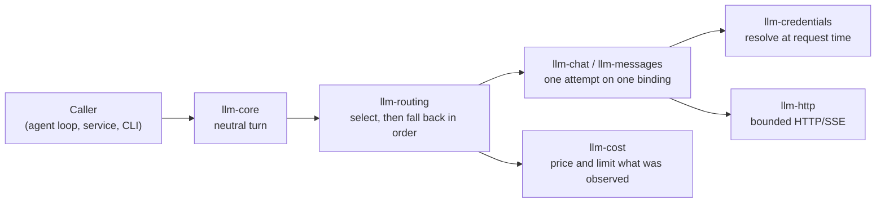

# The five concepts

Vendors routinely bundle five separate things. LLM keeps them apart, and never infers one from
another.

| Concept | What it decides | What it does **not** decide |
| --- | --- | --- |
| **Protocol** | The wire shape: Responses, Messages or Chat Completions | Who is billed, or how the caller authenticates |
| **Provider account** | Which account and billing relationship is used | Which protocol the endpoint speaks |
| **Credential source** | Where the secret bytes come from | Whether the account is metered or a subscription |
| **Model** | Which served model and capability set is addressed | Which endpoint serves it |
| **Hosting provider** | Who owns and bills the compute a model runs on | Anything about an endpoint that already exists |

Two consequences follow:

- An anonymous, self-hosted vLLM server speaking Chat Completions is an ordinary binding. It needs
  no special case.
- A rejected subscription credential never turns into a billable API call. Billing kind is its own
  field, and nothing changes it on rejection.

## A binding joins them, explicitly

A **binding** is one provider, one account, one endpoint, one model and one serving declaration
(the protocol and declared capabilities). An operator names each part in TOML with their own
identifiers. There is no built-in list of vendor model names.

Each binding has a **binding revision**: a SHA-256 over its whole validated declaration, including
the endpoint URL, the upstream model name, the credential reference and the capabilities. Change
any of those and the revision changes. Rotating the secret behind the same reference does not.

## The path of one request

Each step is its own crate, and each one refuses on its own:

1. **Core** validates the request against the target's declared capabilities before any network
   I/O.
2. **Routing** picks a target from the route's ordered list and explains the choice. If fallback is
   on, it tries the next named target only after a failure that is safe to retry.
3. **A protocol client** makes exactly one attempt. It resolves the credential for that attempt and
   sends through the bounded transport.
4. **Accounting** prices what was actually reported, and a durable ledger admits or refuses spend.

The gateway and the hosting lifecycle sit beside this path, not on it: the gateway authenticates an
owner and lists routes; hosting owns the lifecycle of GPU machines. Neither is wired into the
request path yet. See [Not yet](../status/roadmap.md).

## What stays outside

LLM never executes a tool, holds an approval, runs an agent loop, runs a login flow, writes a
credential file or reads a vendor's configuration directory. A tool definition is a name, a
description and a JSON Schema. It grants no permission to run anything. When a model asks for a
tool call, the caller runs it and sends the result in the next request.

Read on: [the neutral turn](neutral-boundary.md), [protocols](protocols.md),
[credentials](credentials.md), [routing](routing.md), [accounting](accounting.md),
[hosting](hosting.md), [the gateway](gateway.md).
