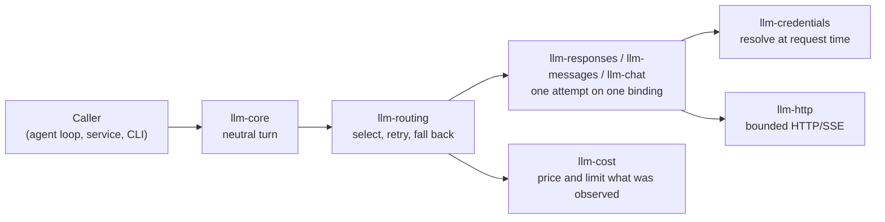

# The five concepts

| Concept | What it decides | What it does **not** decide |
| --- | --- | --- |
| **Protocol** | The wire shape: Responses, Messages or Chat Completions | Who is billed, or how the caller authenticates |
| **Provider account** | Which account and billing relationship is used | Which protocol the endpoint speaks |
| **Credential source** | Where the secret bytes come from | Whether the account is metered or a subscription |
| **Model** | Which served model and capability set is addressed | Which endpoint serves it |
| **Hosting provider** | Who owns and bills the compute a model runs on | Anything about an endpoint that already exists |

Two consequences follow:

- An anonymous, self-hosted vLLM server speaking Chat Completions is an ordinary binding. It needs
  no special case.
- A rejected subscription credential never turns into a billable API call. Billing kind is its own
  field, and nothing changes it on rejection.

## A binding joins them, explicitly

A **binding** is one provider, one account, one endpoint, one model and one serving declaration
(the protocol and declared capabilities). An operator names each part in TOML with their own
identifiers. There is no built-in list of vendor model names.

Each binding has a **binding revision**: a SHA-256 over its whole validated declaration, including
the endpoint URL, the upstream model name, the credential reference and the capabilities. Change
any of those and the revision changes. Rotating the secret behind the same reference does not.

## The path of one request

Each step is its own crate, and each one refuses on its own:

1. **Core** validates the request against the target's declared capabilities before any network
   I/O.
2. **Routing** picks a target from the route's ordered list and explains the choice. A failure
   whose class may be retried, and that showed the caller nothing, is retried on the same target;
   then, if fallback is on, the next named target runs.
3. **A protocol client** makes exactly one attempt. It resolves the credential for that attempt,
   sends through the bounded transport and hands each event to the caller as it arrives.
4. **Accounting** prices what was actually reported, and a durable ledger admits or refuses spend.

Two helpers sit on top of the port: `call_tool` forces one tool and returns its arguments, and
`BlockingModel` runs a turn from a synchronous loop. The gateway and the hosting lifecycle are not
on this path and not in llm: they live in llm-gateway
([GitHub](https://github.com/beyond10x/llm-gateway)), which serves what these clients call.

## Which crate do I need?

| To… | Depend on |
| --- | --- |
| Write a caller that works with any model | `b10x-llm-core` |
| Call a Responses endpoint, including a Codex login | `b10x-llm-responses`, `b10x-llm-http`, `b10x-llm-credentials`, and a binding from `b10x-llm-routing` or `b10x-llm-providers` |
| Call a Chat Completions or vLLM endpoint | `b10x-llm-chat` and the same three |
| Call a Messages endpoint | `b10x-llm-messages` and the same three |
| Force one tool and read its arguments | `b10x-llm-tool-call` |
| Run turns from a synchronous loop | `b10x-llm-blocking` |
| Declare routes in TOML, retry and fall back between targets | `b10x-llm-routing` |
| Price usage, or limit spend | `b10x-llm-cost`, with `sqlite` for the ledger |

[Crates](../reference/crates.md) lists every package with its library name and features.

## What stays outside

llm never executes a tool, holds an approval, runs an agent loop or runs a login flow. It reads
a credential only where the caller pointed it: `codex_model` reads the Codex login under
`CODEX_HOME` or `~/.codex` because calling it asks for exactly that. A tool definition grants no
permission to run anything. When a model asks for a tool call, the caller runs it and sends the
result in the next request.

Read on: [the neutral turn](neutral-boundary.md), [protocols](protocols.md),
[credentials](credentials.md), [routing](routing.md), [accounting](accounting.md).
