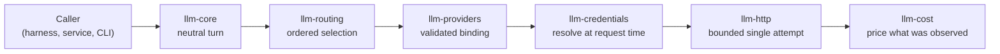

# The five concepts

The repository's central design rule is that five things that vendors routinely conflate stay
independent, and that no one of them may be inferred from another.

| Concept | What it decides | What it does **not** decide |
| --- | --- | --- |
| **Protocol** | The wire shape: Responses, Messages or Chat Completions | Who is billed, or how the caller authenticates |
| **Provider account** | Which account and billing relationship is used | Which protocol the endpoint speaks |
| **Credential source** | Where the secret bytes come from | Whether the account is metered or a subscription |
| **Model** | Which served model and capability set is addressed | Which endpoint serves it |
| **Hosting provider** | Who owns and bills the compute resource | Anything about an already-existing endpoint |

A concrete consequence: an anonymous self-hosted vLLM endpoint speaking Chat Completions is an
ordinary, fully expressible binding — not a special case to be worked around — and a rejected
subscription credential never silently becomes a billable API call.

## The shape of a request

Each hop is a separate crate with a separate refusal surface. Core validates structure and declared
capabilities before any network I/O. Routing decides *which* binding, once, and explains why.
Credentials are resolved per request so rotation works. Transport performs exactly one attempt and
owns no retry policy. Pricing values only what was actually observed.

## What lives outside this boundary

LLM never executes a tool, carries an approval envelope, imports an agent loop, runs a login flow,
writes a credential file or searches an ambient vendor configuration directory. Tool definitions
carry a name, a description and a JSON Schema, and confer no execution permission whatsoever; the
caller supplies tool results in a subsequent request.

Read on: [the neutral boundary](neutral-boundary.md), [credentials](credentials.md),
[routing](routing.md), [accounting](accounting.md).
