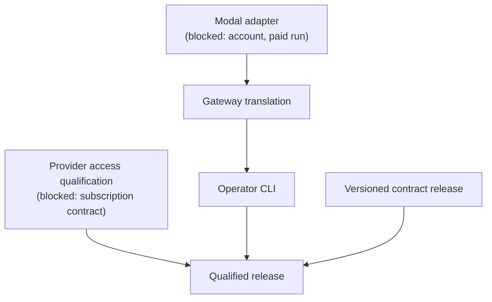

# Not yet

These are not implemented. Each entry says what is missing and what it waits for.

| Item | State | Waits for |
| --- | --- | --- |
| Modal hosting adapter | `llm-modal` exports nothing | A Modal account, a credential source and an authorised paid qualification run |
| Provider access qualification (API and subscription) | Not started | Live evidence; for subscriptions, a documented supported contract per provider |
| Gateway translation | Not started; the gateway refuses to translate | The Modal adapter, among other finished dependencies |
| Operator command line | `llm-cli` exports nothing | Gateway translation |
| A production Runpod transport | Only the in-process emulator exists | Not yet planned as its own item; the live control-plane assumptions on [Hosting](../concepts/hosting.md#not-verified) are unchecked |
| A qualified release | No release exists | All of the above, and the versioned contract release |

## Blocked items

### Modal hosting

The acceptance for the Modal adapter requires a recorded live deployment, readiness check and
cleanup. That needs a Modal account, a credential and a paid run. None is available to this
repository, and the ordinary gate never makes a paid call. The lifecycle-fixture half could be
split out and built first.

### Subscription access

Calling a model through a caller's subscription, rather than a metered API key, is not
implemented and not qualified for either provider. Holding a token is not evidence that a given
use is supported. Each provider's supported contract and permitted deployment context must be
established first. The design is fixed in two ways: the caller owns credential acquisition and
renewal, and LLM will never run a login flow. A rejected subscription credential must never fall
back to a billable API key.

API-key access through the implemented clients is not blocked by this, but it is also not
qualified: no live provider credential has been used here.

## The order of the remaining work

- **Gateway translation** exposes the three protocol surfaces over the published neutral subset,
  preserving streaming, tools, cancellation and usage, or refusing explicitly. Its declared
  dependencies are the gateway surface, ordered fallback, both hosting adapters and unattributed
  opaque state; all but the Modal adapter are done.
- **The operator command line** validates, inspects and runs one configuration from the same TOML.
  Inspection must resolve no secret and start no resource.
- **The qualified release** ties one published version to the full evidence matrix, including live
  API, subscription and hosting results.

## Smaller open items

- **A secrets-library resolver.** An optional adapter that resolves a `SecretRef` through a separate
  shared secrets library. It waits for that library's first release.
- **More ESS specifications.** The gateway, the HTTP transport, provider bindings and the Runpod
  adapter are tested but have no ESS domain of their own yet.
- **Spend enforcement in effectful paths.** The spending ledger exists, but no client or gateway
  takes its permits yet. The hosting controller requires an authorization naming a ledger
  reservation, but cannot see the ledger; the caller must reserve there first. Routing's `admit`
  port is where a caller connects a limit today.
- **Runpod cleanup outside the ledger.** Orphan sweeps and inherited-pod terminations bypass the
  hosting controller, so no stop obligation is recorded for them. Fixing this needs a change to the
  hosting contract.

## Out of scope for this milestone

Choosing the cheapest model automatically. A resolver backed by a connector integration product,
which has been superseded by the secrets-library adapter above.
