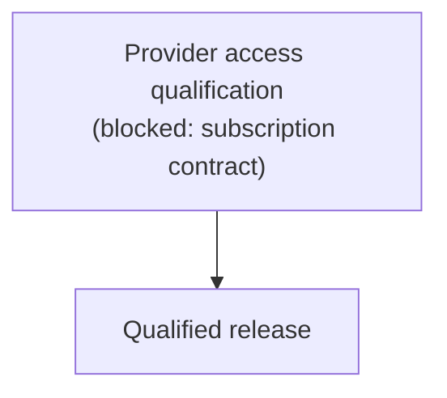

# Not yet

These are not implemented. Each entry says what is missing and what it waits for. The
[Status](/docs/status) page lists the same items among everything that ships. Serving and hosting
work is [llm-gateway](https://beyond10x.github.io/llm-gateway/)'s
([GitHub](https://github.com/beyond10x/llm-gateway)) and is not listed here.

| Item | State | Waits for |
| --- | --- | --- |
| Provider access qualification (API and subscription) | Not qualified; one live Codex probe outside the gate | Recorded live evidence; for subscriptions, a documented supported contract per provider |
| Harness building on llm | A Harness branch builds and passes on llm 0.1.7; Harness still uses its own model wire crates | The Harness side of the move |
| A qualified release | Releases exist; none is qualified | Provider access qualification |

## Blocked items

### Subscription access

Calling a model through a caller's subscription, rather than a metered API key, works mechanically:
`codex_model` reads a Codex login, and `codex-renewal` renews it; an Anthropic subscription token
travels over Messages as a `subscription-oauth` account, resolved through its secret reference
([credentials](../concepts/credentials.md)). It is not qualified for either
provider. Holding a token is not evidence that a given use is supported: each provider's supported
contract and permitted deployment context must be established first. The design is fixed in two
ways: the caller owns credential acquisition, and llm never runs a login flow. A rejected
subscription credential never falls back to a billable API key.

## The order of the remaining work

- **The qualified release** ties one published version to the full evidence matrix, including live
  API and subscription results.

## Smaller open items

- **Spend enforcement in effectful paths.** The spending ledger exists, but no client takes its
  permits yet. Routing's `admit` port is where a caller connects a limit today.

## Out of scope for this milestone

Choosing the cheapest model automatically. An operator command line: `b10x-llm-cli` exports
nothing, and no plan builds it. A resolver backed by a connector integration product, which the
Secrets resolver replaced.
