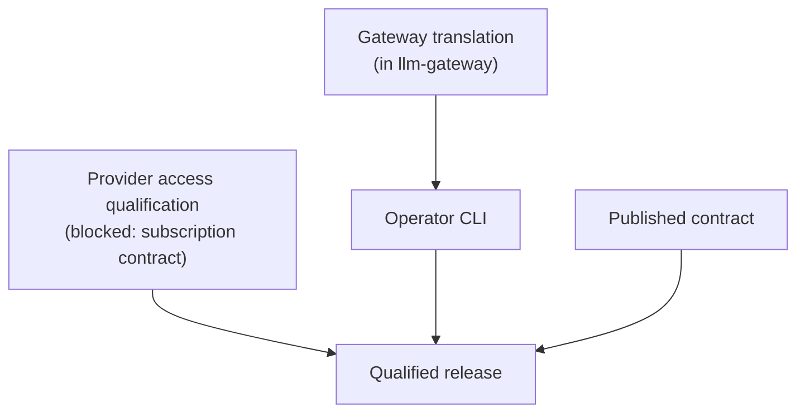

# Not yet

These are not implemented. Each entry says what is missing and what it waits for. The
[Status](/docs/status) page lists the same items among everything that ships. Gateway
translation, the Modal adapter and a production Runpod transport are llm-gateway's work
([GitHub](https://github.com/beyond10x/llm-gateway)) and are not listed here.

| Item | State | Waits for |
| --- | --- | --- |
| Provider access qualification (API and subscription) | Not qualified; one live Codex probe outside the gate | Recorded live evidence; for subscriptions, a documented supported contract per provider |
| A published contract and compatibility policy | The versioned envelopes ship; the policy is not published | The contract release |
| Deployments moved from llmgw | llmgw still serves them | A reversible cutover to llm-gateway |
| Operator command line | `b10x-llm-cli` exports nothing | Gateway translation in llm-gateway |
| Harness building on llm | Harness uses its own model wire crates | The Harness side of the move |
| A qualified release | Releases exist; none is qualified | All of the above |

## Blocked items

### Subscription access

Calling a model through a caller's subscription, rather than a metered API key, works mechanically:
`codex_model` reads a Codex login, and `codex-renewal` renews it; an Anthropic subscription token
travels over Messages as a `subscription-oauth` account, resolved through its secret reference
([credentials](../concepts/credentials.md)). It is not qualified for either
provider. Holding a token is not evidence that a given use is supported: each provider's supported
contract and permitted deployment context must be established first. The design is fixed in two
ways: the caller owns credential acquisition, and llm never runs a login flow. A rejected
subscription credential never falls back to a billable API key.

## The order of the remaining work

- **Gateway translation**, in llm-gateway, exposes the three protocol surfaces over the published
  neutral subset, preserving streaming, tools, cancellation and usage, or refusing explicitly.
- **The operator command line** validates, inspects and runs one configuration from the same TOML.
  Inspection must resolve no secret and start no resource.
- **The qualified release** ties one published version to the full evidence matrix, including live
  API, subscription and hosting results.

## Smaller open items

- **A Secrets resolver.** An optional adapter that resolves a `SecretRef` through the named storage
  of [Secrets](https://beyond10x.github.io/secrets/) ([GitHub](https://github.com/beyond10x/secrets)).
  It waits for that library's release.
- **Spend enforcement in effectful paths.** The spending ledger exists, but no client or gateway
  takes its permits yet. Routing's `admit` port is where a caller connects a limit today.

## Out of scope for this milestone

Choosing the cheapest model automatically. A resolver backed by a connector integration product,
which has been superseded by the Secrets adapter above.
